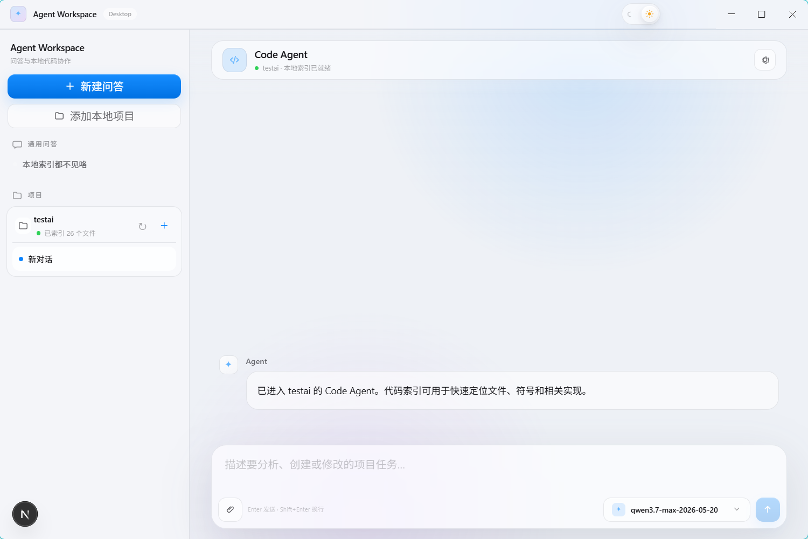
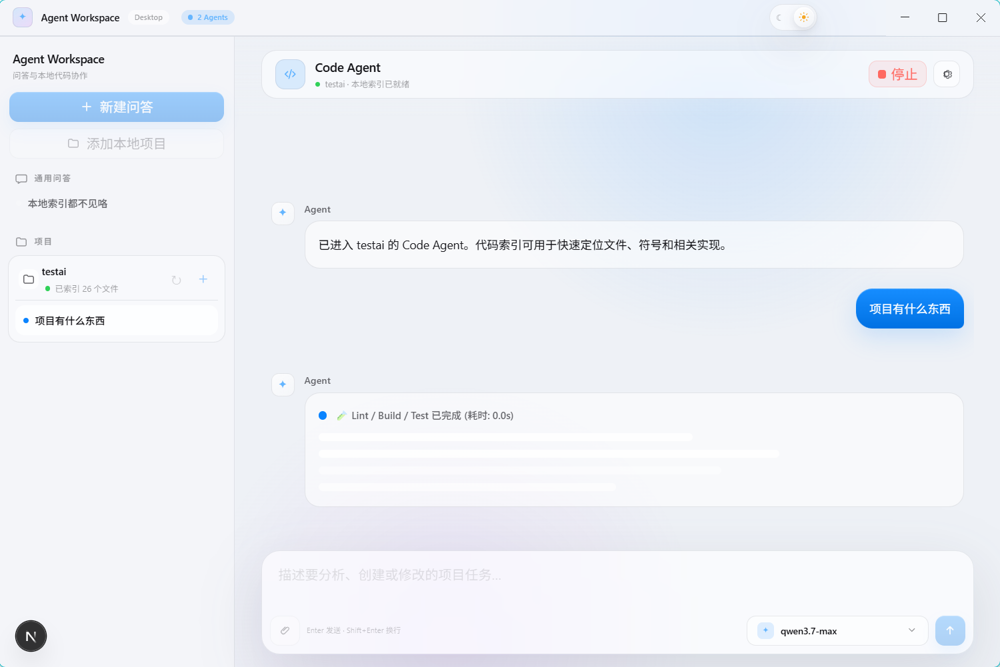
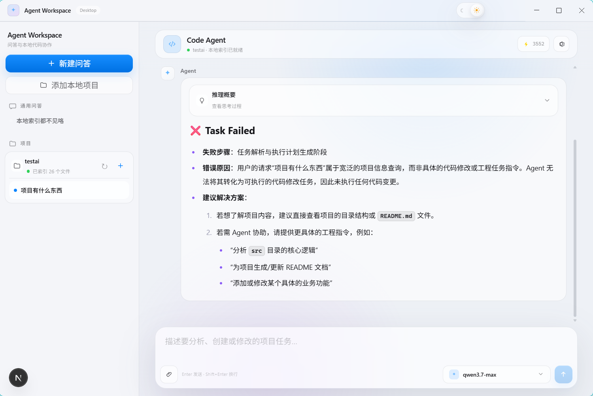
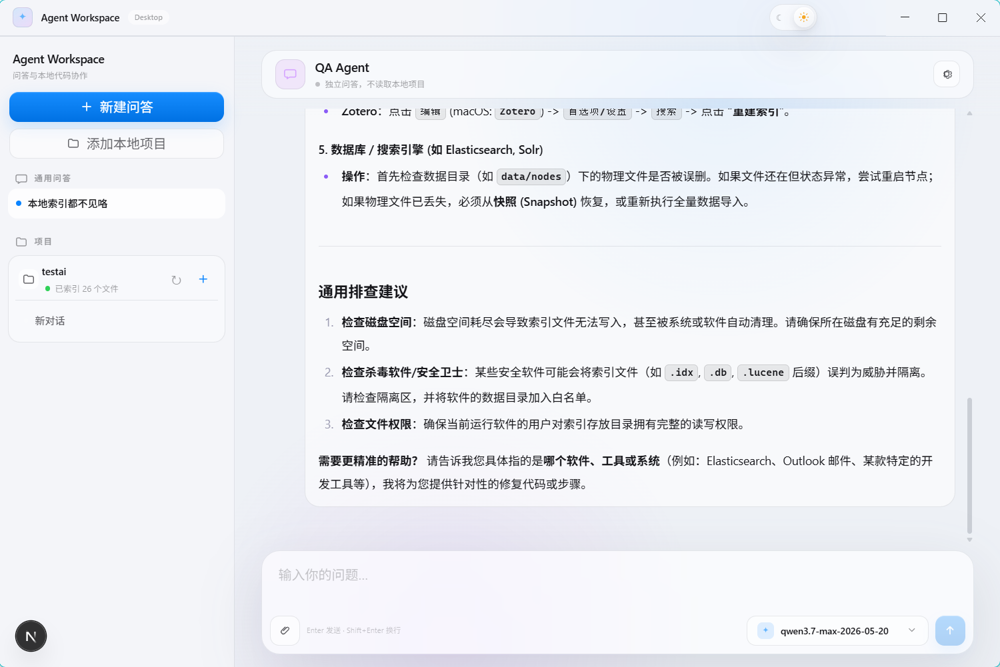
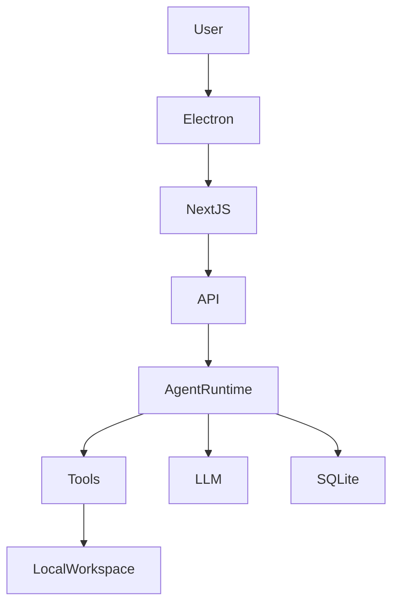

# Agent Workspace

> 一个基于 Electron + Next.js 的智能 Agent
> 工作空间，支持本地代码理解、项目索引、工具调用、多 Agent
> 工作流以及流式交互。

Agent Workspace 将桌面端能力、Web UI、代码分析能力和 AI Agent
编排结合在一起，目标是提供类似 AI 编程助手的本地开发环境。

------------------------------------------------------------------------

## Screenshots





------------------------------------------------------------------------

## Features

### Core Features

-   ✅ Electron Desktop Application
-   ✅ Next.js App Router Web Interface
-   ✅ QA Agent 与 Code Agent 双模式
-   ✅ 本地项目 Workspace 管理
-   ✅ SQLite 会话与项目数据持久化
-   ✅ 本地代码索引与搜索
-   ✅ 文件读取、修改建议、Diff、Patch 应用
-   ✅ Terminal Tool 支持
-   ✅ SSE 流式响应
-   ✅ 深色 / 浅色主题
-   ✅ Apple 风格 Glassmorphism UI

------------------------------------------------------------------------

## Agent Workflow

Code Agent 使用 LangGraph 组织任务流程：

``` text
User Request

      ↓

Orchestrator

      ↓

 ┌───────────────┐
 │               │
 ↓               ↓

Search        Memory/File

 │               │
 └───────┬───────┘

         ↓

      Planner

         ↓

 Modify Agents

         ↓

     Reviewer

         ↓

 Lint / Build / Test

         ↓

 Final Report
```

当前支持的 Agent 角色：

  Agent          Responsibility
  -------------- ----------------
  Orchestrator   总任务调度
  Planner        任务拆解与规划
  Researcher     搜索项目上下文
  Coder          文件修改
  Reviewer       修改审查
  Terminal       命令执行

------------------------------------------------------------------------

## Tech Stack

### Desktop

-   Electron
-   Node.js

### Frontend

-   Next.js
-   React
-   TypeScript
-   Tailwind CSS

### Agent

-   LangGraph
-   LangChain Core
-   LLM API

### Storage

-   SQLite

------------------------------------------------------------------------

## Architecture



------------------------------------------------------------------------

## Project Structure

``` text
.
├── app/
│   ├── api/              # Next.js API Routes
│   ├── component/        # UI Components
│   ├── hooks/            # React Hooks
│   ├── lib/server/       # Server-side services
│   ├── const/            # Constants and theme
│   └── types/            # Shared types
│
├── electron/
│   ├── main.ts           # Electron main process
│   └── preload.ts        # Secure bridge
│
├── public/
│
├── scripts/
│
├── package.json
├── README.md
├── AGENTS.md
└── LICENSE
```

------------------------------------------------------------------------

## Installation

Requirements:

-   Node.js
-   pnpm

Install dependencies:

``` bash
pnpm install
```

------------------------------------------------------------------------

## Development

### Web Development

``` bash
pnpm dev
```

Default:

    http://localhost:3000

### Electron Development

``` bash
pnpm electron:dev
```

------------------------------------------------------------------------

## Build

Web build:

``` bash
pnpm build
```

Electron:

``` bash
pnpm electron:build
```

Create installer:

``` bash
pnpm electron:make
```

------------------------------------------------------------------------

## Environment Variables

Create:

``` text
.env.local
```

Example:

``` env
DASHSCOPE_API_KEY=
```

Available variables:

  Variable                 Description
  ------------------------ -----------------------
  DASHSCOPE_API_KEY        LLM API Key
  GEMINI_API_KEY           Gemini API
  AGENT_DATA_DIR           SQLite data directory
  NEXT_PUBLIC_SENTRY_DSN   Sentry monitoring

Do not commit real keys.

------------------------------------------------------------------------

## SSE Protocol

The application uses Server-Sent Events for streaming responses.

Supported events:

  Event                 Description
  --------------------- ------------------------------
  TEXT                  Streaming assistant output
  STATUS                Agent status
  TOOL_STATUS           Tool execution state
  USAGE                 Token usage
  INTERACTIVE_REQUEST   Terminal interaction request

Reserved:

-   AGENT_START
-   AGENT_STATUS
-   AGENT_PROGRESS
-   AGENT_FINISH
-   AGENT_ERROR

------------------------------------------------------------------------

## UI Design

The interface follows Apple-inspired design principles:

-   Glassmorphism
-   Dark / Light mode
-   Blur materials
-   Smooth animations
-   Consistent spacing system
-   Theme variables instead of hard-coded colors

------------------------------------------------------------------------

## Development Guide

For AI coding agents, please read:

    AGENTS.md

It contains:

-   Project architecture
-   Coding conventions
-   Agent modification rules
-   Safety constraints
-   Important files

------------------------------------------------------------------------

## Roadmap

### Completed

-   [x] Electron desktop application
-   [x] Workspace management
-   [x] Code indexing
-   [x] Agent workflow
-   [x] Tool execution
-   [x] Streaming response
-   [x] Theme system

### Planned

-   [ ] Dynamic Agent Graph generation
-   [ ] Persistent Agent Memory
-   [ ] Plugin System
-   [ ] Better Code Diff Review
-   [ ] More autonomous development workflow

------------------------------------------------------------------------

## Contributing

Contributions are welcome.

Workflow:

1.  Fork repository
2.  Create branch
3.  Make changes
4.  Run checks
5.  Submit Pull Request

------------------------------------------------------------------------

## License

This project is licensed under the MIT License.

See:

    LICENSE

for details.