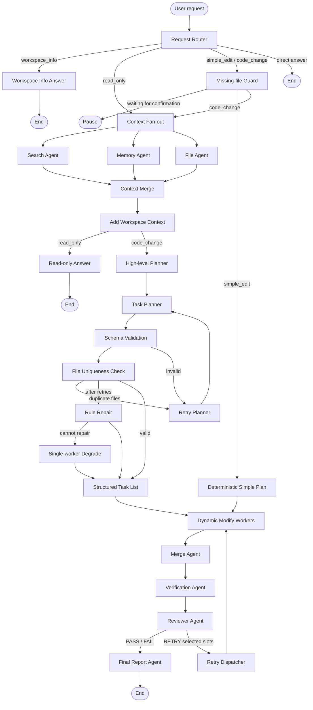
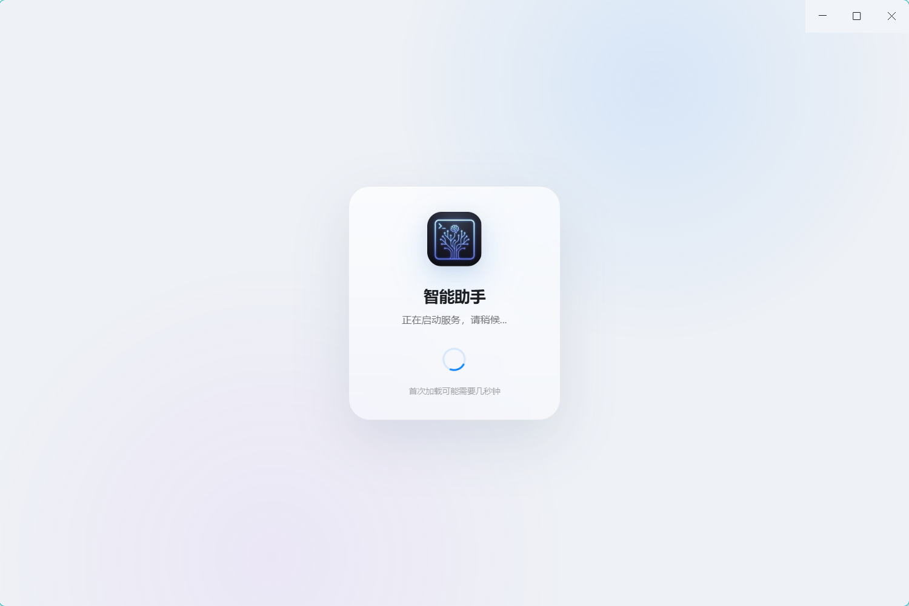
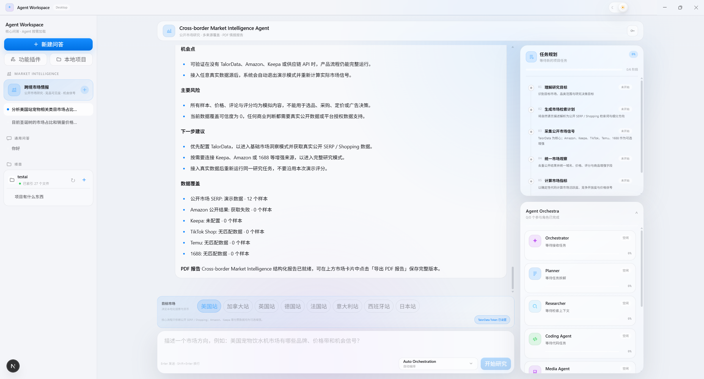
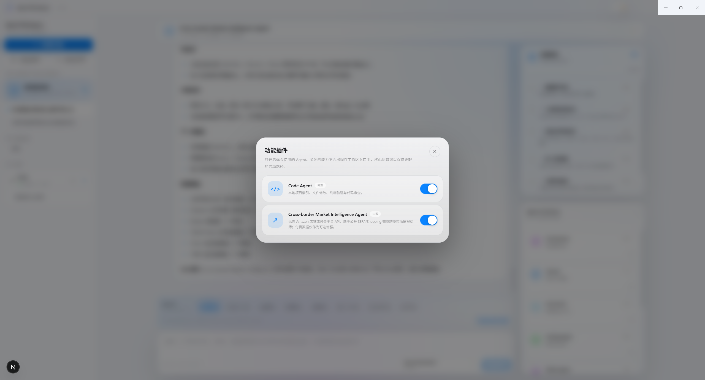
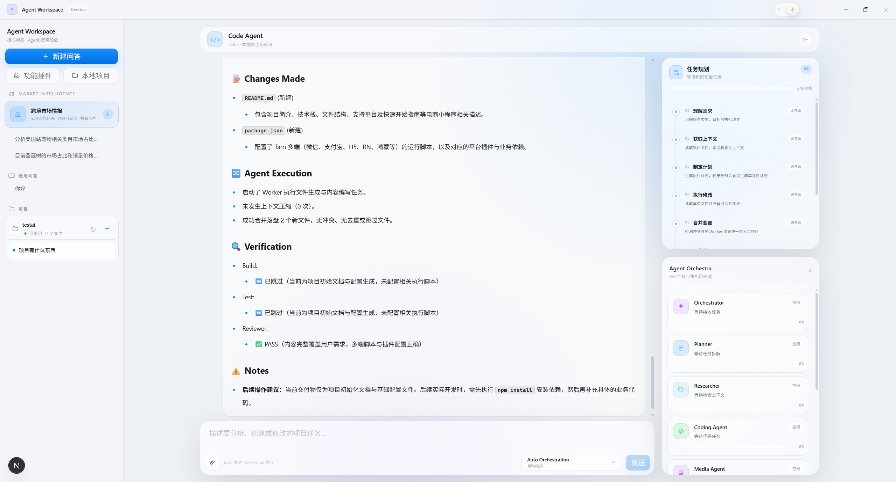
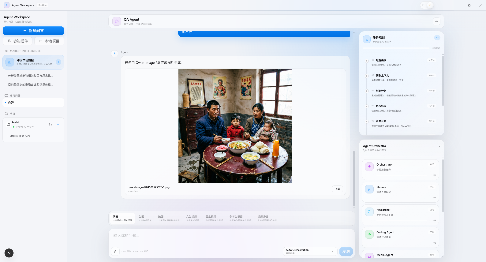
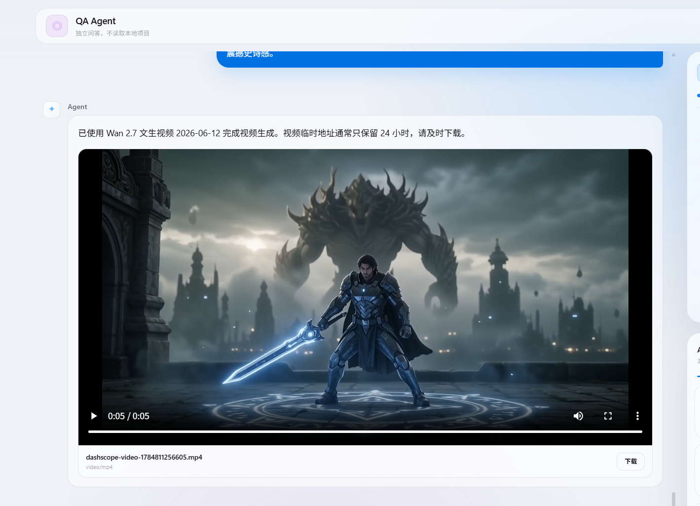

# Multi-agent

**English** | [简体中文](./README_CN.md)

Multi-agent is a local-first AI workspace built with **Electron, Next.js, React, TypeScript, LangGraph, and SQLite**. It combines general multimodal chat, local code collaboration, AI image/video generation, and cross-border market intelligence in one desktop application while keeping the workflows isolated from one another.

This README is derived from the current source tree. For implementation-level details, read [AGENT_SOURCE_GUIDE.md](./AGENT_SOURCE_GUIDE.md). Contributors and coding agents should also read [AGENTS.md](./AGENTS.md).

## Table of Contents

- [What Multi-agent Provides](#what-multi-agent-provides)
- [System Architecture](#system-architecture)
- [Code Agent Workflow](#code-agent-workflow)
- [Agent Roles and Handoffs](#agent-roles-and-handoffs)
- [Safety and Reliability](#safety-and-reliability)
- [Technology Stack](#technology-stack)
- [Repository Layout](#repository-layout)
- [Requirements](#requirements)
- [Installation](#installation)
- [Configuration](#configuration)
- [Development](#development)
- [Packaging](#packaging)
- [Usage](#usage)
- [API and Streaming Events](#api-and-streaming-events)
- [Local Data](#local-data)
- [Troubleshooting](#troubleshooting)
- [Screenshots](#screenshots)
- [Security](#security)
- [License](#license)

## What Multi-agent Provides

### 1. QA Agent

The default QA workflow is intentionally lightweight and independent from local code projects.

- Streaming text responses through the unified LLM gateway
- Vision input for image understanding
- Provider-independent multimodal message normalization
- Model capability routing and provider fallback
- Prompt, completion, and total-token accounting
- Independent QA sessions persisted in the workspace database

The QA route is implemented in `app/api/qa/route.ts` and uses the shared LLM gateway under `app/lib/llm/`.

### 2. Code Agent

The Code Agent is the most complete multi-agent workflow in the repository.

- Binds a conversation to an explicit local project directory
- Builds a local SQLite file/content/symbol index
- Classifies each request into one of four execution modes
- Collects context through Search, Memory, and File agents in parallel
- Uses a two-level hierarchical planner for complex changes
- Dynamically creates one isolated Modify Worker per leaf task
- Stages complete-file proposals instead of allowing workers to overwrite files
- Deduplicates identical proposals and performs conservative three-way merging
- Detects workspace changes that occurred while workers were running
- Runs document, targeted, or full verification based on touched files
- Uses a Reviewer Agent to pass, fail, or retry selected worker slots
- Persists LangGraph checkpoints in SQLite
- Streams real agent lifecycle events to the UI

### 3. Media Agent

Media generation is separated from text chat because image and video models use different protocols and task lifecycles.

Supported modes:

- Text to image
- Image editing
- Text to video
- Image to video
- Reference image to video
- Video editing

The media pipeline includes:

- A dedicated media model catalog
- Attachment type and size validation
- Image-edit fidelity policies: `precise`, `balanced`, and `creative`
- Typography policies for generated text
- Optional quality assessment and automatic retry for unreliable image edits
- Asynchronous polling for video tasks
- Preview, persistence, and download metadata

### 4. Cross-border Market Intelligence Agent

The Commerce workflow performs category discovery, multi-source collection, normalization, deterministic analytics, optional LLM strategy generation, and structured report output.

- Public SERP/Shopping research as the core data path
- Optional TalorData, Keepa, Amazon SP-API, TikTok, Temu, and 1688 enhancements
- Multi-source orchestration with health/status reporting
- Full, reduced, and clearly marked demo execution modes
- Deterministic market metrics and source-confidence scoring
- Structured report cards and PDF export through Electron
- Separate SSE events for progress and final reports

## System Architecture

```mermaid
flowchart LR
    UI[Electron / Next.js UI]
    QA[/api/qa]
    CODE[/api/chat]
    MEDIA[/api/media/generate]
    COMMERCE[/api/commerce/research]
    LLM[Unified LLM Gateway]
    GRAPH[LangGraph Code Workflow]
    MEDIA_API[DashScope Media APIs]
    DATA[Commerce Data-source Orchestrator]
    SQLITE[(SQLite)]

    UI --> QA
    UI --> CODE
    UI --> MEDIA
    UI --> COMMERCE

    QA --> LLM
    CODE --> GRAPH
    GRAPH --> LLM
    GRAPH --> SQLITE
    MEDIA --> MEDIA_API
    COMMERCE --> LLM
    COMMERCE --> DATA
    UI --> SQLITE
```

The main architectural rule is **workflow isolation**:

- QA does not read a local project unless the user enters Code mode.
- Media requests do not pass through the Code Agent graph.
- Commerce reports do not reuse Code Agent state or media task state.
- LLM credentials are held in request-local async context and are not written into LangGraph checkpoints.

## Code Agent Workflow

### Request modes

`app/api/chat/agent/request-classifier.ts` deterministically classifies each Code request:

| Mode | Meaning | Execution path |
|---|---|---|
| `workspace_info` | Ask only for the current project name/path/binding | Local deterministic answer; no LLM planner |
| `read_only` | Inspect or explain the project without changing files | Parallel context collection, then read-only LLM answer |
| `simple_edit` | Explicit modification of one documentation file | Missing-file guard, deterministic one-task plan, one worker, merge, verification, review |
| `code_change` | General or multi-file implementation request | Full hierarchical planning and dynamic worker workflow |

### Full graph


```mermaid
flowchart TD
    START([User request]) --> ROUTER[Request Router]

    ROUTER -->|workspace_info| WS[Workspace Info Answer]
    ROUTER -->|read_only| FANOUT[Context Fan-out]
    ROUTER -->|simple_edit / code_change| GUARD[Missing-file Guard]
    ROUTER -->|direct answer| END1([End])

    WS --> END2([End])
    GUARD -->|waiting for confirmation| END3([Pause])
    GUARD -->|simple_edit| SIMPLE[Deterministic Simple Plan]
    GUARD -->|code_change| FANOUT

    FANOUT --> SEARCH[Search Agent]
    FANOUT --> MEMORY[Memory Agent]
    FANOUT --> FILE[File Agent]
    SEARCH --> MERGECTX[Context Merge]
    MEMORY --> MERGECTX
    FILE --> MERGECTX
    MERGECTX --> ENRICH[Add Workspace Context]

    ENRICH -->|read_only| READ[Read-only Answer]
    READ --> END4([End])

    ENRICH -->|code_change| HLP[High-level Planner]
    HLP --> TP[Task Planner]
    TP --> SCHEMA[Schema Validation]
    SCHEMA --> UNIQUE[File Uniqueness Check]
    SCHEMA -->|invalid| RETRYP[Retry Planner]
    RETRYP --> TP
    UNIQUE -->|duplicate files| RETRYP
    UNIQUE -->|after retries| REPAIR[Rule Repair]
    REPAIR -->|cannot repair| DEGRADE[Single-worker Degrade]
    UNIQUE -->|valid| TASKS[Structured Task List]
    REPAIR --> TASKS
    DEGRADE --> TASKS
    SIMPLE --> WORKERS
    TASKS --> WORKERS[Dynamic Modify Workers]

    WORKERS --> MERGE[Merge Agent]
    MERGE --> VERIFY[Verification Agent]
    VERIFY --> REVIEW[Reviewer Agent]
    REVIEW -->|PASS / FAIL| REPORT[Final Report Agent]
    REVIEW -->|RETRY selected slots| DISPATCH[Retry Dispatcher]
    DISPATCH --> WORKERS
    REPORT --> END5([End])
```

### Dynamic worker execution

For a valid leaf-task array, LangGraph creates one `Send("modify_worker", input)` operation per task. Each worker receives:

- Its own task and slot number
- Read-only shared memory
- Its previous compressed worker memory, if any
- Previous result from the same slot during a review retry
- Reviewer feedback
- The approved list of missing files that may be created
- The selected model and bound workspace

Worker tool messages stay local to that worker. They are not appended to the main conversation state, preventing cross-worker tool-message contamination.

### File-change lifecycle

```text
read_file_from_disk
        ↓
propose_file_change   → complete proposed file content + diff
        ↓
apply_file_change     → mark proposal ready for Merge
        ↓
Merge Agent           → conflict checks + atomic-style write/rollback
        ↓
Verification Agent
        ↓
Reviewer Agent
```

A Modify Worker does **not** directly overwrite the formal workspace. In parallel mode, `apply_file_change` means “ready for merge,” not “write now.”

## Agent Roles and Handoffs

| Agent / control role | Main responsibility | Receives from | Sends to |
|---|---|---|---|
| Request Router | Reset transient state, restore interactive replies, classify request mode | API route / checkpoint | Direct answer, workspace answer, guard, or context fan-out |
| Search Agent | Search the SQLite project index and scan the codebase for candidate files | Context fan-out | Context Merge |
| Memory Agent | Collect long-term summary and recent conversation context | Context fan-out | Context Merge |
| File Agent | Read explicitly named paths or return a root-directory overview | Context fan-out | Context Merge |
| Context Merge | Combine Search, Memory, and File outputs | Three context agents | Context enrichment |
| High-level Planner | Produce module/workstream objectives and dependencies | Merged project context | Task Planner |
| Task Planner | Convert high-level work into independent file-level leaf tasks | High-level plan | Schema and uniqueness validation |
| Modify Worker(s) | Read files, use tools, create complete-file proposals, maintain isolated memory | Structured task list or retry dispatcher | Merge Agent |
| Merge Agent | Deduplicate, three-way merge, detect stale bases, write files, roll back on write failure | All worker results | Verification Agent |
| Verification Agent | Choose document/targeted/full checks and run real commands | Merge result | Reviewer Agent |
| Reviewer Agent | Evaluate merged files and verification; PASS, FAIL, or RETRY selected slots | Verification result and file preview | Final Report or Retry Dispatcher |
| Final Report Agent | Summarize plan, modifications, merge, review, verification, and risks | Final workflow state | Final streamed answer |
| Media Agent | Generate/edit images and videos through the media provider | Media composer | Preview/download result and media review state |
| Commerce Agent | Coordinate category analysis, data sources, metrics, insights, and report output | Commerce session | Commerce report card and PDF export |

The UI maps backend lifecycle roles to a smaller display-role set such as Orchestrator, Planner, Researcher, Coder, Reviewer, Terminal, Media, and Commerce.

## Safety and Reliability

### Workspace safety

- Code sessions require a valid stored project directory; the API does not silently fall back to an unrelated current directory.
- File paths are normalized and constrained to the bound workspace.
- Modification requests for an explicitly named but missing file can pause for user confirmation.
- Approval to create a missing file is scoped to the current request and cleared on the next normal task.
- Workers must submit full UTF-8 file content; “rest unchanged” placeholders are not accepted by the tool contract.

### Parallel merge safety

The Merge Agent supports:

1. **Single proposal** — one ready proposal for a file.
2. **Identical deduplication** — multiple workers proposed identical content.
3. **Conservative three-way merge** — workers changed disjoint line ranges from the same base.
4. **Conflict rejection** — overlapping edits, different bases, worker failures, or workspace changes block the write.
5. **Rollback** — if writing one of several merged files fails, the merge attempts to restore files already written in the same operation.

### Review and retry

- Reviewer decisions are `PASS`, `RETRY`, or `FAIL`.
- Retry targets are worker slot indexes, so only affected tasks are rerun.
- The current implementation allows up to two review-retry iterations.
- A worker can return `satisfied` during retry when the previous target content is still present and no additional patch is required.

### Adaptive verification

| Profile | Trigger | Behavior |
|---|---|---|
| `none` | No touched files | Skip verification |
| `document` | Only `.md`, `.mdx`, `.txt`, `.rst`, `.adoc` | Confirm files exist; do not run project build/test |
| `targeted` | Only JS/TS-family files | Run ESLint on touched files, plus configured build/test scripts |
| `full` | Mixed or other code/config files | Run available project checks |

Package-manager detection supports pnpm, Bun, Yarn, and npm lockfiles.

## Technology Stack

| Layer | Technologies |
|---|---|
| Desktop | Electron 43, electron-builder, Node.js child process hosting Next.js |
| Web UI | Next.js 16, React 19, TypeScript 6, Tailwind CSS 4 |
| Agent runtime | LangGraph 1.x, LangChain Core 1.x |
| LLM providers | Qwen/DashScope, OpenAI, Gemini, DeepSeek, GLM, Kimi |
| Media | Qwen-Image, Wan, HappyHorse through DashScope media APIs |
| Persistence | `node:sqlite`, WAL mode, separate workspace and checkpoint databases |
| Rendering | React Markdown, GFM, React Virtuoso |
| Monitoring | Sentry for Next.js |

## Repository Layout

```text
.
├── app/
│   ├── api/
│   │   ├── qa/                         # Lightweight QA streaming route
│   │   ├── chat/
│   │   │   ├── agent/                  # LangGraph state, graph, nodes, tools runtime
│   │   │   └── server/                 # Route orchestration and SSE adapters
│   │   ├── media/                      # Image/video generation and download
│   │   ├── commerce/                   # Market intelligence research and status APIs
│   │   ├── workspace/                  # Local projects and sessions
│   │   └── projects/[projectId]/index/ # Project index endpoint
│   ├── component/                      # Workspace, chat, agent, media, commerce UI
│   ├── hooks/                          # Client workflow controllers
│   ├── lib/
│   │   ├── llm/                        # Provider abstraction, routing, prompts
│   │   ├── media/                      # Catalog, provider client, edit policies
│   │   ├── commerce/                   # Sources, analytics, orchestration, reports
│   │   ├── rag/                        # Attachment chunking and retrieval
│   │   ├── plugins/                    # Built-in plugin registry
│   │   └── server/                     # Workspace path and SQLite store
│   └── utils/
├── electron/                           # Main process and preload bridge
├── scripts/                            # Electron compile/build/icon scripts
├── public/                             # Application assets
├── AGENT_SOURCE_GUIDE.md
├── AGENTS.md
├── README.md
└── README_CN.md
```

## Requirements

- **Node.js 22 or later** is recommended because the server uses the built-in `node:sqlite` module.
- pnpm
- A supported LLM API key for the text workflows you intend to use
- `DASHSCOPE_API_KEY` for Qwen chat and DashScope image/video generation
- Platform-specific build tools when packaging Electron installers

## Installation

```bash
pnpm install
```

Create a local environment file:

```bash
cp env.example .env.local
```

On Windows PowerShell:

```powershell
Copy-Item env.example .env.local
```

## Configuration

### LLM providers

| Variable | Purpose |
|---|---|
| `DASHSCOPE_API_KEY` | Qwen/DashScope text and media access |
| `OPENAI_API_KEY` | OpenAI-compatible chat provider |
| `GEMINI_API_KEY` | Google Gemini provider |
| `DEEPSEEK_API_KEY` | DeepSeek provider |
| `GLM_API_KEY` | GLM/BigModel provider |
| `KIMI_API_KEY` | Kimi/Moonshot provider |
| `DASHSCOPE_API_BASE` | Optional DashScope base override |
| `DASHSCOPE_UPLOAD_API_BASE` | Optional media-upload base override |

The UI may also send provider keys through request headers. Keys are resolved server-side and stored in request-local context, not in LangGraph state.

### Commerce data sources

| Variable | Purpose |
|---|---|
| `TALORDATA_API_TOKEN` | Preferred TalorData SERP token |
| `SERPAPI_API_KEY` | Backward-compatible SERP alias |
| `TALORDATA_SERP_ENDPOINT` | Optional TalorData endpoint override |
| `KEEPA_API_KEY` | Optional Amazon historical/rank enhancement |
| `TIKTOK_CLIENT_KEY`, `TIKTOK_CLIENT_SECRET`, `TIKTOK_MERCHANT_ID` | Optional TikTok integration |
| `TEMU_APP_KEY`, `TEMU_APP_SECRET`, `TEMU_ACCESS_TOKEN`, `TEMU_API_ENDPOINT` | Optional Temu integration |
| `ALIBABA_1688_APP_KEY`, `ALIBABA_1688_APP_SECRET`, `ALIBABA_1688_ACCESS_TOKEN`, `ALIBABA_1688_API_ENDPOINT` | Optional 1688 integration |
| `AMAZON_SP_API_CLIENT_ID`, `AMAZON_SP_API_CLIENT_SECRET`, `AMAZON_SP_API_REFRESH_TOKEN`, `AMAZON_SP_API_ACCESS_TOKEN` | Optional Amazon seller-data enhancement |
| `AMAZON_PUBLIC_RESEARCH_ENABLED` | Enables optional direct Amazon public-page research; disabled by default |

### Local storage

| Variable | Purpose |
|---|---|
| `AGENT_DATA_DIR` | Overrides the directory containing workspace and LangGraph SQLite databases |

Web development defaults to `./.agent-data`. Packaged Electron runs set the data directory under the operating system's application user-data directory.

## Development

### Start the Next.js application

```bash
pnpm dev
```

### Start Electron in development mode

```bash
pnpm electron:dev
```

Before starting Next.js, the Electron main process scans for an available local
port beginning at `3000`. If that port is occupied, it automatically moves to
`3001`, `3002`, and so on without terminating the process that owns the port.

### Static validation

```bash
pnpm lint
pnpm build
pnpm test:electron-port
```

`pnpm test:electron-port` temporarily occupies a random local port, verifies
that Electron skips it, and then confirms the released port can be selected.

### Compile only the Electron main/preload process

```bash
pnpm electron:compile
```

## Packaging

```bash
pnpm electron:package
```

Build an installer:

```bash
pnpm electron:make
```

The build script compiles Electron, builds Next.js in standalone mode, copies `.next-electron/standalone`, static assets, public assets, and optionally `.env.local`, then invokes electron-builder.

> The current source tree still contains several legacy package and installer labels such as `Agent Workspace` and `MyApp`. Documentation and the intended product name are **Multi-agent**. Before publishing binaries, align `package.json`, `electron-builder.yml`, Electron window labels, report footers, app IDs, artifact names, and installer shortcut names.

## Usage

### QA

1. Open or create a QA session.
2. Select `Auto` or a specific compatible chat model.
3. Enter a question or attach an image.
4. Read the streamed answer and usage data.

### Code Agent

1. Enable the Code Agent plugin.
2. Select a local project directory.
3. Build or refresh the project index.
4. Create a Code session bound to that project.
5. Ask a read-only question or request a modification.
6. For a missing explicitly named target file, approve or cancel the create-file prompt.
7. Follow the live agent lifecycle, merge, verification, and review states.

Example read-only request:

```text
Explain how the request router chooses between read_only, simple_edit, and code_change.
```

Example change request:

```text
Add validation to the workspace creation endpoint and update its error handling tests.
```

### Image editing

1. Select an image-edit media mode.
2. Upload an image under the mode's size limit.
3. Choose `precise` for UI, product, or localized edits.
4. State both the requested change and what must remain unchanged.
5. Enable the quality guard when consistency matters.

### Commerce research

1. Enable the Commerce plugin.
2. Create a Commerce session.
3. Enter a category, product idea, or market question.
4. Select a marketplace and sample size.
5. Review source status, confidence, metrics, products, observations, warnings, and recommended next steps.
6. In Electron, export the structured report to PDF.

## API and Streaming Events

### Main routes

| Route | Method | Purpose |
|---|---|---|
| `/api/qa` | POST | General streaming QA and image understanding |
| `/api/chat` | POST | Code Agent LangGraph workflow |
| `/api/media/generate` | POST | Image/video generation and editing |
| `/api/media/download` | GET | Proxy/download media results |
| `/api/commerce/research` | POST | Commerce research SSE workflow |
| `/api/commerce/data-source/status` | GET/POST | Commerce source health and connectivity |
| `/api/workspace` | GET/POST | Projects and session persistence |
| `/api/projects/[projectId]/index` | POST | Rebuild the local project index |
| `/api/models` | GET | Model catalog exposed to the UI |
| `/api/config` | GET | Service configuration status |

### Common SSE packet types

| Type | Meaning |
|---|---|
| `TEXT` | Streamed assistant text |
| `STATUS` | Human-readable workflow status |
| `TOOL_STATUS` | Tool start/completion/error state |
| `USAGE` | Token or media usage information |
| `INTERACTIVE_REQUEST` | Terminal or missing-file confirmation required |
| `AGENT_LIFECYCLE` | Backend LangGraph lifecycle event |
| `COMMERCE_PROGRESS` | Commerce research progress update |
| `COMMERCE_REPORT` | Structured commerce report |
| `AGENT_START`, `AGENT_STATUS`, `AGENT_PROGRESS`, `AGENT_FINISH`, `AGENT_ERROR` | UI-compatible agent status events |

## Local Data

By default, three server-side databases are created:

```text
.agent-data/
├── agent-workspace.sqlite          # projects, sessions, project memory, index data
├── langgraph-checkpoints.sqlite    # LangGraph thread checkpoints and pending writes
└── agent-observability.sqlite      # Agent traces, tool events, and evaluations
```

The workspace database uses WAL mode and foreign keys. The index stores file metadata, selected text content, and simple symbol records. Current indexing limits include a maximum of 6,000 supported files and 512 KiB per indexed file.

## Troubleshooting

### `node:sqlite` cannot be resolved

Use Node.js 22 or later for web/server development. Electron has its own embedded Node runtime, but standalone Next.js development still uses the locally installed Node version.

### A Code request edits the wrong directory

Code mode should use the project record stored in SQLite. Re-select the project, verify the displayed root path, and rebuild the index. The route intentionally rejects missing or invalid workspace bindings rather than silently using `process.cwd()`.

### Planner repeatedly fails

The graph retries invalid plans, validates schema and cross-task file uniqueness, applies rule-based repair, and finally degrades to a single worker. Check model credentials, raw planner output, lifecycle events, and whether the user request names impossible or conflicting file scopes.

### Merge reports `workspace_changed`

The formal file changed after a worker captured its base content. Re-run the task against the latest workspace or manually reconcile the conflict. The Merge Agent refuses to overwrite a stale base.

### Build fails after a documentation-only task

Documentation-only changes use the `document` verification profile and should not fail because of unrelated project build errors. Confirm that all touched files use one of the recognized documentation extensions.

### Media edit produces ghosting or duplicate objects

Use `precise` fidelity, request one local change at a time, avoid redesign language, state preservation requirements, and enable the quality guard.

### Commerce output is in demo mode

No usable real source returned data. Configure and test TalorData or another supported source. Demo results are explicitly marked and should not be treated as commercial facts.

### Electron opens a startup error page

The application selects an available port automatically. Check whether the
standalone server exists in packaged resources and whether the Next.js child
process logs report missing environment variables, dependencies, or native
modules. The startup log prints the actual selected port.

## Screenshots









## Security

- Never commit `.env.local`, real provider keys, or Sentry upload credentials.
- Do not expose service credentials in client bundles, logs, screenshots, or checkpoint state.
- Do not publish `.agent-data/`, local SQLite files, user projects, or generated private media.
- Review the Electron build behavior before distributing an archive: the current build script can copy `.env.local` into packaged standalone resources.
- Keep workspace path validation and safe-path checks intact when adding new file tools.
- Avoid enabling destructive terminal commands without a separate authorization policy.

Recommended ignore list:

```text
.env.local
.env.sentry-build-plugin
.agent-data/
.next/
.electron/
out/
out-server/
node_modules/
```

## License

MIT. See [LICENSE](./LICENSE).

## Agent production features

The project now includes online evaluation, human-in-the-loop risk approval, MCP tool integration, tool-call repair, local Agent tracing, and bounded context caching. See [AGENT_PRODUCTION_FEATURES.md](./AGENT_PRODUCTION_FEATURES.md). The trace dashboard is available at `/observability` after startup.
