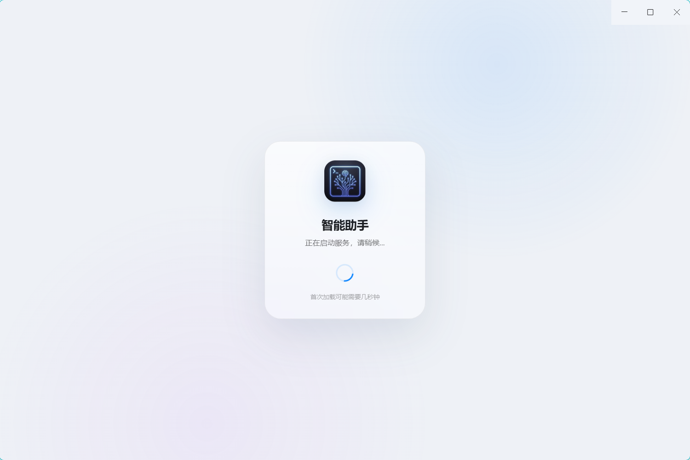
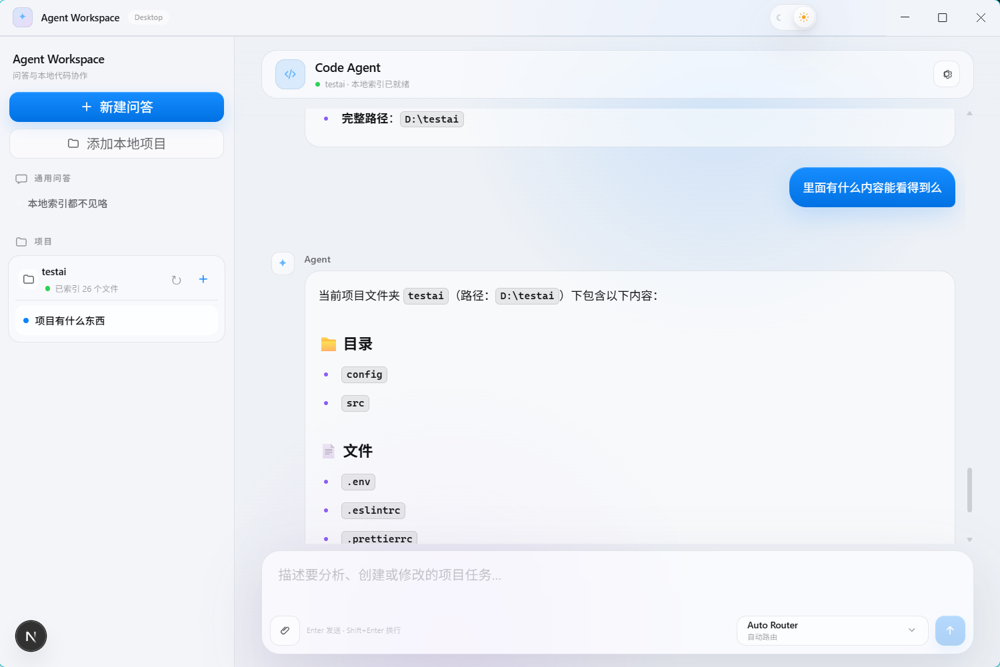
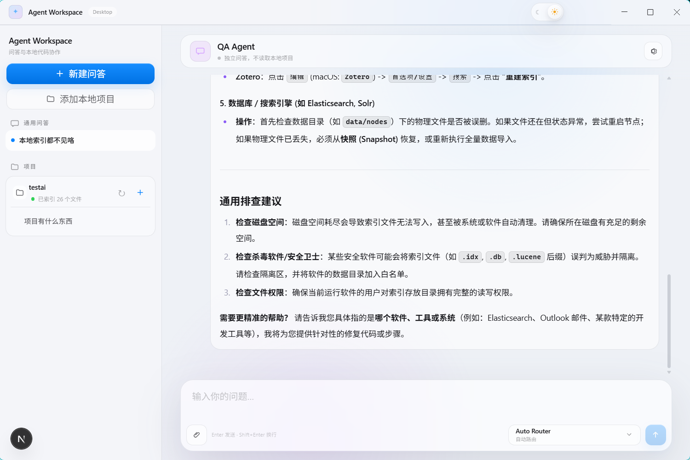
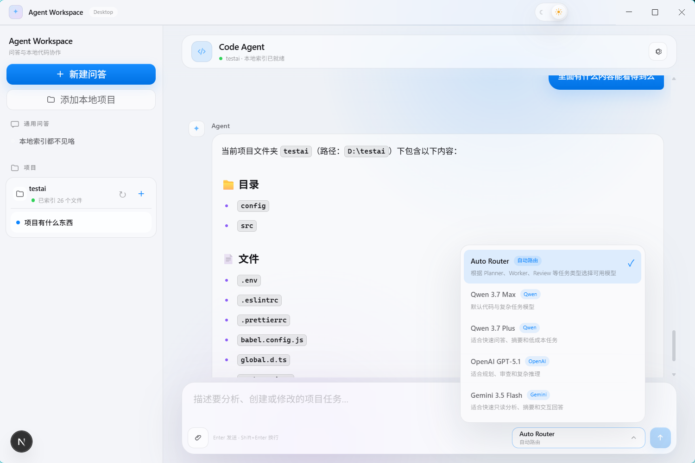
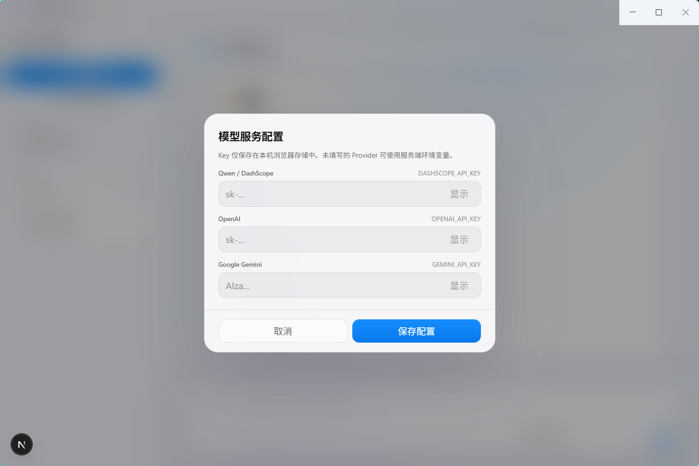

# Agent Workspace

[English Version](./README.md) \| 中文


## 项目介绍

Agent Workspace 是一款基于 Electron + Next.js 的本地 AI Agent 开发工作空间。

它结合桌面应用、本地项目理解、代码分析和 Agent Runtime，提供类似 Cursor
/ Claude Code 的 AI 编程体验。

支持：

-   理解本地项目
-   搜索和分析代码
-   自动规划任务
-   安全修改源码
-   执行开发工具
-   审查代码变化
-   长任务恢复

------------------------------------------------------------------------

## 项目截图








------------------------------------------------------------------------

# 核心功能

## AI Coding Agent

提供完整 AI 辅助开发流程：

-   项目理解
-   代码搜索
-   任务规划
-   文件修改
-   Diff 生成
-   Patch 应用
-   构建验证
-   代码审查

流程：

``` text
用户需求
      |
请求路由
      |
Orchestrator
      |
搜索 + Memory + 文件上下文
      |
Planner
      |
代码修改 Worker
      |
Reviewer
      |
Lint / Build / Test
      |
最终报告
```

------------------------------------------------------------------------

# 多 Agent 架构

基于 LangGraph 构建 Agent 工作流。

  Agent          职责
  -------------- ----------------
  Orchestrator   全局任务调度
  Planner        任务拆解
  Researcher     项目上下文检索
  Coder          代码修改
  Reviewer       修改验证
  Terminal       命令执行

------------------------------------------------------------------------

# LLM Gateway 架构

Agent Workspace 通过 LLM Gateway 将 Agent 与模型供应商解耦。

架构：

``` text
Agent Runtime

      |

LLM Gateway

      |

+------+-------+------+
|      |       |
Qwen OpenAI Gemini
```

支持：

-   Provider 抽象
-   Model Router
-   Prompt Registry
-   多模型切换
-   流式输出
-   Token 统计

支持模型：

-   通义千问
-   OpenAI
-   Gemini

------------------------------------------------------------------------

# RAG 能力

支持本地知识检索：

-   文档解析
-   文本切片
-   内容召回
-   上下文注入
-   长文档优化

支持：

-   源代码
-   文档
-   PDF
-   项目资料

------------------------------------------------------------------------

# 技术栈

## Desktop

-   Electron
-   Node.js

## 前端

-   Next.js
-   React
-   TypeScript
-   Tailwind CSS

## AI

-   LangGraph
-   LangChain Core
-   LLM Gateway
-   RAG

## 存储

-   SQLite

------------------------------------------------------------------------

# 项目结构

``` text
app/
 ├── api/
 ├── component/
 ├── hooks/
 └── lib/
      ├── llm/
      │    ├── providers/
      │    ├── prompts/
      │    ├── model-router.ts
      │    └── gateway.ts
      └── rag/

electron/
 ├── main.ts
 └── preload.ts
```

------------------------------------------------------------------------

# 图片目录

截图放置：

``` text
docs/images/
```

文件：

``` text
whitesnow-cover.png
main-interface.png
agent-workflow.png
code-diff.png
```

------------------------------------------------------------------------

# 安装

``` bash
pnpm install
```

# 开发

``` bash
pnpm dev
pnpm electron:dev
```

------------------------------------------------------------------------

# 环境变量

``` env
DASHSCOPE_API_KEY=
OPENAI_API_KEY=
GEMINI_API_KEY=
AGENT_DATA_DIR=
```

不要提交真实 Key。

------------------------------------------------------------------------

# Roadmap

已完成：

-   Electron 桌面应用
-   Workspace 管理
-   Code Agent
-   Multi-Agent 工作流
-   Tool Calling
-   SSE 流式响应
-   RAG
-   LLM Provider Gateway
-   多模型路由
-   Prompt Registry

计划：

-   插件系统
-   动态 Agent Graph
-   长期记忆
-   更自主的代码开发流程

------------------------------------------------------------------------

# License

MIT License