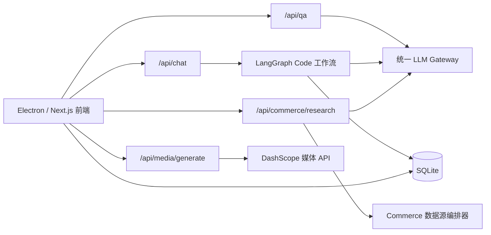
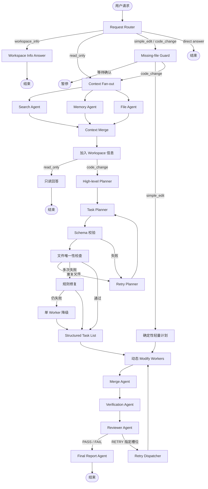

# Multi-agent

[English](./README.md) | **简体中文**

Multi-agent 是一个基于 **Electron、Next.js、React、TypeScript、LangGraph 与 SQLite** 构建的本地优先 AI 工作台。它将通用多模态问答、本地代码协作、AI 图片/视频生成以及跨境市场情报研究整合到同一个桌面应用中，同时保持不同工作流之间的状态和协议隔离。

本文档根据当前源码整理。需要逐文件理解实现时，请阅读 [AGENT_SOURCE_GUIDE.md](./AGENT_SOURCE_GUIDE.md)；参与开发或让编码 Agent 修改本项目时，请先阅读 [AGENTS.md](./AGENTS.md)。

## 目录

- [项目能力](#项目能力)
- [整体架构](#整体架构)
- [Code Agent 完整流程](#code-agent-完整流程)
- [Agent 职责与流转](#agent-职责与流转)
- [安全与可靠性设计](#安全与可靠性设计)
- [技术栈](#技术栈)
- [项目目录](#项目目录)
- [环境要求](#环境要求)
- [安装](#安装)
- [环境变量](#环境变量)
- [开发与构建](#开发与构建)
- [使用方法](#使用方法)
- [API 与 SSE 事件](#api-与-sse-事件)
- [本地数据](#本地数据)
- [常见问题](#常见问题)
- [项目截图](#项目截图)
- [安全说明](#安全说明)
- [License](#license)

## 项目能力

### 1. QA Agent

QA 是默认的轻量问答工作流，不会因为普通对话自动读取本地项目。

- 流式文本回答
- 图片理解与多模态输入
- Provider 无关的消息归一化
- 根据任务能力自动选择模型并支持故障降级
- Prompt、Completion 和 Total Token 统计
- 独立 QA 会话持久化

对应入口为 `app/api/qa/route.ts`，统一模型网关位于 `app/lib/llm/`。

### 2. Code Agent

Code Agent 是仓库中最完整的多 Agent 编排系统。

- 将 Code 会话绑定到明确的本地项目目录
- 在 SQLite 中建立文件、内容和符号索引
- 将请求确定性分类为四种执行模式
- 并行运行 Search、Memory、File 三个上下文 Agent
- 对复杂任务采用两层 Hierarchical Planner
- 根据叶子任务数量动态创建 Modify Worker
- Worker 只生成完整文件提案，不直接覆盖正式文件
- Merge Agent 负责相同提案去重、保守三方合并、冲突检测与写入回滚
- 根据真实变更文件选择文档、定向或完整工程验证
- Reviewer Agent 可通过、失败或只返工指定 Worker 槽位
- 使用 SQLite 保存 LangGraph checkpoint
- 将真实 Agent 生命周期通过 SSE 推送到前端

### 3. Media Agent

图片和视频模型采用独立协议，因此媒体工作流不经过 QA 或 Code Agent 的文本链路。

支持模式：

- 文生图
- 图片编辑
- 文生视频
- 图生视频
- 参考图生视频
- 视频编辑

媒体链路包含：

- 独立媒体模型注册表
- 附件 MIME 类型与大小限制
- `precise`、`balanced`、`creative` 三种图片编辑保真策略
- 生成文字策略控制
- 可选图片编辑质量检测与自动重试
- 视频异步任务轮询
- 结果预览、持久化与下载信息

### 4. Cross-border Market Intelligence Agent

Commerce 工作流负责类目理解、多源采集、口径归一化、确定性指标计算、可选 LLM 策略生成和结构化报告输出。

- 以公开 SERP / Shopping 研究作为核心数据路径
- 可选接入 TalorData、Keepa、Amazon SP-API、TikTok、Temu、1688
- 多数据源编排和健康状态展示
- 完整研究、降级研究、明确标记的 Demo 三档运行模式
- 确定性市场指标与数据源置信度评分
- 结构化报告卡片
- Electron 内导出 PDF
- 独立 Commerce SSE 进度与报告事件

## 整体架构


```mermaid
flowchart LR
    UI["Electron / Next.js 前端"]
    QA["/api/qa"]
    CODE["/api/chat"]
    MEDIA["/api/media/generate"]
    COMMERCE["/api/commerce/research"]
    LLM[统一 LLM Gateway]
    GRAPH[LangGraph Code 工作流]
    MEDIA_API[DashScope 媒体 API]
    DATA[Commerce 数据源编排器]
    SQLITE[(SQLite)]

    UI --> QA
    UI --> CODE
    UI --> MEDIA
    UI --> COMMERCE

    QA --> LLM
    CODE --> GRAPH
    GRAPH --> LLM
    GRAPH --> SQLITE
    MEDIA --> MEDIA_API
    COMMERCE --> LLM
    COMMERCE --> DATA
    UI --> SQLITE
```

核心原则是 **工作流隔离**：

- QA 模式默认不读取本地项目。
- Media 请求不进入 Code Agent 的 LangGraph。
- Commerce 报告不复用 Code Agent 或媒体任务状态。
- LLM 凭证保存在当前请求的异步上下文中，不写入 LangGraph State 或 checkpoint。

## Code Agent 完整流程

### 四种请求模式

`app/api/chat/agent/request-classifier.ts` 会对 Code 请求做确定性分类：

| 模式 | 含义 | 流程 |
|---|---|---|
| `workspace_info` | 只询问当前项目名称、路径或绑定信息 | 本地直接回答，不调用 Planner |
| `read_only` | 需要读取和解释项目，但不修改文件 | 三路上下文并行收集后生成只读回答 |
| `simple_edit` | 明确修改一个文档文件 | 缺失文件检查、确定性单任务、单 Worker、Merge、验证、Review |
| `code_change` | 通用、多文件或复杂开发任务 | 完整两层 Planner + 动态 Worker 流程 |

### LangGraph 主流程


```mermaid
flowchart TD
    START([用户请求]) --> ROUTER[Request Router]

    ROUTER -->|workspace_info| WS[Workspace Info Answer]
    ROUTER -->|read_only| FANOUT[Context Fan-out]
    ROUTER -->|simple_edit / code_change| GUARD[Missing-file Guard]
    ROUTER -->|direct answer| END1([结束])

    WS --> END2([结束])
    GUARD -->|等待确认| END3([暂停])
    GUARD -->|simple_edit| SIMPLE[确定性轻量计划]
    GUARD -->|code_change| FANOUT

    FANOUT --> SEARCH[Search Agent]
    FANOUT --> MEMORY[Memory Agent]
    FANOUT --> FILE[File Agent]
    SEARCH --> MERGECTX[Context Merge]
    MEMORY --> MERGECTX
    FILE --> MERGECTX
    MERGECTX --> ENRICH[加入 Workspace 信息]

    ENRICH -->|read_only| READ[只读回答]
    READ --> END4([结束])

    ENRICH -->|code_change| HLP[High-level Planner]
    HLP --> TP[Task Planner]
    TP --> SCHEMA[Schema 校验]
    SCHEMA --> UNIQUE[文件唯一性检查]
    SCHEMA -->|失败| RETRYP[Retry Planner]
    RETRYP --> TP
    UNIQUE -->|重复文件| RETRYP
    UNIQUE -->|多次失败| REPAIR[规则修复]
    REPAIR -->|仍失败| DEGRADE[单 Worker 降级]
    UNIQUE -->|通过| TASKS[Structured Task List]
    REPAIR --> TASKS
    DEGRADE --> TASKS
    SIMPLE --> WORKERS
    TASKS --> WORKERS[动态 Modify Workers]

    WORKERS --> MERGE[Merge Agent]
    MERGE --> VERIFY[Verification Agent]
    VERIFY --> REVIEW[Reviewer Agent]
    REVIEW -->|PASS / FAIL| REPORT[Final Report Agent]
    REVIEW -->|RETRY 指定槽位| DISPATCH[Retry Dispatcher]
    DISPATCH --> WORKERS
    REPORT --> END5([结束])
```

### 动态 Worker

每一个合法叶子任务都会通过 LangGraph `Send("modify_worker", input)` 创建一个隔离 Worker。Worker 会收到：

- 当前任务与槽位编号
- 只读 Shared Memory
- 当前槽位上一轮的压缩 Worker Memory
- Reviewer 返工时的上一轮结果
- Reviewer 反馈
- 用户已经批准可新建的缺失文件列表
- 模型、项目 ID 和工作目录

Worker 的 AI 消息与 Tool 消息只存在于自身运行时，不写入主线程 `messages`，从而避免不同 Worker 的工具调用互相污染。

### 文件修改闭环

```text
read_file_from_disk
        ↓
propose_file_change   → 提交完整新内容并生成差异
        ↓
apply_file_change     → 仅标记为可合并
        ↓
Merge Agent           → 冲突检测、统一写入、失败回滚
        ↓
Verification Agent
        ↓
Reviewer Agent
```

并发 Worker 中的 `apply_file_change` 不等于立即写盘，只代表将提案加入 Merge 队列。

## Agent 职责与流转

| Agent / 控制角色 | 核心职责 | 上游 | 下游 |
|---|---|---|---|
| Request Router | 重置瞬态状态、恢复交互回复、识别执行模式 | API Route / checkpoint | 直接回答、Workspace、Guard 或上下文分发 |
| Search Agent | 查询 SQLite 项目索引并扫描代码库 | Context Fan-out | Context Merge |
| Memory Agent | 整理长期摘要与最近对话 | Context Fan-out | Context Merge |
| File Agent | 读取用户点名文件或项目根目录概览 | Context Fan-out | Context Merge |
| Context Merge | 合并 Search、Memory、File 输出 | 三个上下文 Agent | Context Enrichment |
| High-level Planner | 生成模块级目标、范围和依赖 | 合并上下文 | Task Planner |
| Task Planner | 拆分可独立执行的文件级叶子任务 | High-level Plan | Schema 与唯一性校验 |
| Modify Worker | 读取真实文件、调用工具、生成完整文件提案、维护独立记忆 | Structured Task List / Retry Dispatcher | Merge Agent |
| Merge Agent | 去重、三方合并、检测过期基线、统一写盘和回滚 | 全部 Worker 结果 | Verification Agent |
| Verification Agent | 按变更类型运行真实校验 | Merge 结果 | Reviewer Agent |
| Reviewer Agent | 结合文件快照与验证结果给出 PASS、RETRY、FAIL | Verification | Final Report / Retry Dispatcher |
| Final Report Agent | 汇总计划、修改、合并、审查、验证和风险 | 完整图状态 | 最终流式回答 |
| Media Agent | 通过媒体 Provider 生成或编辑图片、视频 | Media Composer | 预览、下载、质量状态 |
| Commerce Agent | 类目分析、数据源编排、指标计算、洞察与报告 | Commerce Session | 报告卡片与 PDF |

前端会把后端更细的生命周期角色映射成 Orchestrator、Planner、Researcher、Coder、Reviewer、Terminal、Media、Commerce 等展示角色。

## 安全与可靠性设计

### Workspace 安全

- Code 会话必须绑定有效的持久化项目目录。
- API 不会在缺少项目绑定时静默退回无关的 `process.cwd()`。
- 文件路径会被规范化并限制在当前工作区内。
- 用户要求修改一个明确存在的文件但文件实际缺失时，可暂停并请求确认是否创建。
- 缺失文件新建授权只对当前任务有效，下一次普通任务会清空。
- 文件工具要求提交完整 UTF-8 文件内容，不允许使用“其余不变”等占位写法。

### 并发 Merge 安全

Merge Agent 支持：

1. **单提案写入**：一个文件只有一个 ready 提案。
2. **相同结果去重**：多个 Worker 给出完全相同的新内容。
3. **保守三方合并**：多个 Worker 基于同一旧内容修改互不重叠的行区间。
4. **冲突拒绝**：重叠修改、基线不同、Worker 失败或正式文件在执行期间发生变化时拒绝覆盖。
5. **失败回滚**：多文件写入中途失败时，尽可能恢复本次操作已经写入的文件。

### Reviewer 与返工

- Reviewer 输出 `PASS`、`RETRY` 或 `FAIL`。
- `RETRY` 使用 Worker 槽位编号，只重新执行受影响的任务。
- 当前最多允许两轮 Reviewer 返工。
- 返工 Worker 如果确认上一轮目标内容仍已落盘，可返回 `satisfied`，避免重复修改。

### 自适应验证

| Profile | 触发条件 | 行为 |
|---|---|---|
| `none` | 没有变更文件 | 跳过验证 |
| `document` | 只修改 `.md`、`.mdx`、`.txt`、`.rst`、`.adoc` | 检查文件是否落盘，不运行全项目构建 |
| `targeted` | 只修改 JS/TS 系文件 | 对变更文件运行 ESLint，并执行已有 build/test 脚本 |
| `full` | 混合文件或其他代码/配置文件 | 执行可用工程检查 |

包管理器识别支持 pnpm、Bun、Yarn 和 npm。

## 技术栈

| 层级 | 技术 |
|---|---|
| Desktop | Electron 43、electron-builder、Node 子进程运行 Next.js |
| Web UI | Next.js 16、React 19、TypeScript 6、Tailwind CSS 4 |
| Agent Runtime | LangGraph 1.x、LangChain Core 1.x |
| LLM Provider | Qwen/DashScope、OpenAI、Gemini、DeepSeek、GLM、Kimi |
| Media | DashScope 上的 Qwen-Image、Wan、HappyHorse |
| Persistence | `node:sqlite`、WAL、Workspace 与 Checkpoint 分库 |
| Rendering | React Markdown、GFM、React Virtuoso |
| Monitoring | Sentry for Next.js |

## 项目目录

```text
.
├── app/
│   ├── api/
│   │   ├── qa/                         # 轻量 QA 流式接口
│   │   ├── chat/
│   │   │   ├── agent/                  # LangGraph State、Graph、Node、工具执行
│   │   │   └── server/                 # Route 编排与 SSE 适配
│   │   ├── media/                      # 图片/视频生成与下载
│   │   ├── commerce/                   # 市场情报研究与数据源状态
│   │   ├── workspace/                  # 本地项目和会话持久化
│   │   └── projects/[projectId]/index/ # 项目索引接口
│   ├── component/                      # 工作区、聊天、Agent、媒体、电商 UI
│   ├── hooks/                          # 前端工作流控制器
│   ├── lib/
│   │   ├── llm/                        # Provider 抽象、路由、Prompt
│   │   ├── media/                      # 模型目录、Provider、编辑策略
│   │   ├── commerce/                   # 数据源、指标、编排、报告
│   │   ├── rag/                        # 附件分块与检索
│   │   ├── plugins/                    # 内置插件注册表
│   │   └── server/                     # Workspace 路径和 SQLite Store
│   └── utils/
├── electron/                           # 主进程与 preload
├── scripts/                            # Electron 编译、构建、图标脚本
├── public/                             # 应用资源
├── AGENT_SOURCE_GUIDE.md
├── AGENTS.md
├── README.md
└── README_CN.md
```

## 环境要求

- 推荐 **Node.js 22 或更高版本**，服务端使用了内置 `node:sqlite`。
- pnpm
- 至少一个受支持的文本模型 API Key
- 使用 Qwen 聊天或图片/视频生成功能时需要 `DASHSCOPE_API_KEY`
- 打包 Electron 安装包时需要对应平台的构建工具

## 安装

```bash
pnpm install
cp env.example .env.local
```

Windows PowerShell：

```powershell
Copy-Item env.example .env.local
```

## 环境变量

### LLM Provider

| 变量 | 用途 |
|---|---|
| `DASHSCOPE_API_KEY` | Qwen / DashScope 文本和媒体能力 |
| `OPENAI_API_KEY` | OpenAI Provider |
| `GEMINI_API_KEY` | Google Gemini Provider |
| `DEEPSEEK_API_KEY` | DeepSeek Provider |
| `GLM_API_KEY` | GLM / BigModel Provider |
| `KIMI_API_KEY` | Kimi / Moonshot Provider |
| `DASHSCOPE_API_BASE` | 可选 DashScope Base URL |
| `DASHSCOPE_UPLOAD_API_BASE` | 可选媒体上传 Base URL |

前端也可以通过请求头传入 Provider Key。服务端会将凭证保存在请求级异步上下文中，不写入 LangGraph State。

### Commerce 数据源

| 变量 | 用途 |
|---|---|
| `TALORDATA_API_TOKEN` | 首选 TalorData SERP Token |
| `SERPAPI_API_KEY` | 兼容旧版本的 SERP Key |
| `TALORDATA_SERP_ENDPOINT` | 可选 TalorData Endpoint |
| `KEEPA_API_KEY` | 可选 Amazon 历史与排名增强 |
| `TIKTOK_CLIENT_KEY`、`TIKTOK_CLIENT_SECRET`、`TIKTOK_MERCHANT_ID` | 可选 TikTok 接入 |
| `TEMU_APP_KEY`、`TEMU_APP_SECRET`、`TEMU_ACCESS_TOKEN`、`TEMU_API_ENDPOINT` | 可选 Temu 接入 |
| `ALIBABA_1688_APP_KEY`、`ALIBABA_1688_APP_SECRET`、`ALIBABA_1688_ACCESS_TOKEN`、`ALIBABA_1688_API_ENDPOINT` | 可选 1688 接入 |
| `AMAZON_SP_API_CLIENT_ID`、`AMAZON_SP_API_CLIENT_SECRET`、`AMAZON_SP_API_REFRESH_TOKEN`、`AMAZON_SP_API_ACCESS_TOKEN` | 可选 Amazon 卖家数据增强 |
| `AMAZON_PUBLIC_RESEARCH_ENABLED` | 是否启用可选 Amazon 公开页研究，默认关闭 |

### 本地存储

| 变量 | 用途 |
|---|---|
| `AGENT_DATA_DIR` | 自定义 Workspace 与 LangGraph SQLite 文件目录 |

Web 开发默认写入项目根目录下的 `.agent-data`。Electron 打包运行时会将其设置到操作系统应用用户数据目录中。

## 开发与构建

### Next.js 开发

```bash
pnpm dev
```

### Electron 开发

```bash
pnpm electron:dev
```

Electron 主进程启动前会从 `3000` 开始扫描可用端口，并把最终端口同时注入
Next.js 子进程和 BrowserWindow。`3000` 被占用时会自动使用 `3001`、`3002` 等
可用端口，不再结束占用端口的其他程序。

### 检查与构建

```bash
pnpm lint
pnpm build
pnpm test:electron-port
```

`pnpm test:electron-port` 会临时占用一个随机本机端口，验证 Electron 能自动跳过该端口，
并在端口释放后重新选择它。

### 仅编译 Electron 主进程

```bash
pnpm electron:compile
```

### 打包

```bash
pnpm electron:package
pnpm electron:make
```

构建脚本会编译 Electron、构建 Next.js standalone、复制 `.next-electron/standalone`、静态资源、`public`，并在存在时复制 `.env.local`，最后调用 electron-builder。

> 当前源码中仍存在 `Agent Workspace`、`MyApp` 等旧名称。文档和目标项目名统一为 **Multi-agent**。正式发布前应同步修改 `package.json`、`electron-builder.yml`、Electron 窗口标题、报告页脚、App ID、安装包名称和快捷方式名称。

## 使用方法

### QA

1. 新建或打开 QA 会话。
2. 选择 `Auto` 或指定兼容模型。
3. 输入问题，或上传图片进行理解。
4. 查看流式回答和 Token 用量。

### Code Agent

1. 在插件中心启用 Code Agent。
2. 选择本地项目目录。
3. 创建或刷新项目索引。
4. 新建绑定到该项目的 Code 会话。
5. 提出只读问题或修改需求。
6. 如果明确指定的目标文件不存在，在交互卡片中确认是否新建。
7. 查看 Agent 生命周期、Worker、Merge、验证和 Review 结果。

只读请求示例：

```text
解释 request router 如何在 read_only、simple_edit 和 code_change 之间选择。
```

修改请求示例：

```text
为 workspace 创建接口增加参数校验，并补充对应错误处理测试。
```

### 图片编辑

1. 选择图片编辑模式。
2. 上传满足大小限制的图片。
3. UI、商品图或局部改图优先选择 `precise`。
4. 同时说明“要修改什么”和“哪些内容必须保持不变”。
5. 对一致性要求高时开启质量检查。

### Commerce 研究

1. 启用 Commerce 插件。
2. 新建 Commerce 会话。
3. 输入类目、产品想法或市场问题。
4. 选择市场和采样数量。
5. 查看数据源状态、置信度、指标、商品、观察结果、风险和下一步建议。
6. Electron 中可导出结构化 PDF 报告。

## API 与 SSE 事件

### 主要接口

| Route | Method | 用途 |
|---|---|---|
| `/api/qa` | POST | 通用流式问答与图片理解 |
| `/api/chat` | POST | Code Agent LangGraph 工作流 |
| `/api/media/generate` | POST | 图片/视频生成与编辑 |
| `/api/media/download` | GET | 媒体结果代理下载 |
| `/api/commerce/research` | POST | Commerce SSE 研究流程 |
| `/api/commerce/data-source/status` | GET/POST | 数据源健康与连通性 |
| `/api/workspace` | GET/POST | 项目和会话持久化 |
| `/api/projects/[projectId]/index` | POST | 重建本地项目索引 |
| `/api/models` | GET | 模型目录 |
| `/api/config` | GET | 服务配置状态 |

### 常见 SSE 类型

| Type | 含义 |
|---|---|
| `TEXT` | 流式正文 |
| `STATUS` | 可读工作流状态 |
| `TOOL_STATUS` | 工具开始、完成或错误 |
| `USAGE` | Token 或媒体用量 |
| `INTERACTIVE_REQUEST` | 需要终端输入或缺失文件确认 |
| `AGENT_LIFECYCLE` | LangGraph 真实生命周期事件 |
| `COMMERCE_PROGRESS` | Commerce 研究进度 |
| `COMMERCE_REPORT` | 结构化 Commerce 报告 |
| `AGENT_START`、`AGENT_STATUS`、`AGENT_PROGRESS`、`AGENT_FINISH`、`AGENT_ERROR` | 前端兼容 Agent 状态事件 |

## 本地数据

默认会创建三个服务端数据库：

```text
.agent-data/
├── agent-workspace.sqlite          # 项目、会话、项目记忆和索引
├── langgraph-checkpoints.sqlite    # LangGraph 线程 checkpoint 与 pending write
└── agent-observability.sqlite      # Agent Trace、工具事件与在线评估报告
```

Workspace 数据库使用 WAL 和外键。项目索引保存文件元数据、可检索文本和简单符号记录。当前索引上限为 6,000 个支持类型文件，单文件最大 512 KiB。

## 常见问题

### 无法解析 `node:sqlite`

Web/服务端开发请使用 Node.js 22 或更高版本。Electron 内置自己的 Node Runtime，但本地 Next.js 开发仍使用系统 Node。

### Code Agent 使用了错误目录

Code 模式应以 SQLite 中的项目记录为准。重新选择项目，核对 UI 显示的根路径并重建索引。Route 会拒绝无效绑定，而不是静默使用无关目录。

### Planner 持续失败

系统会重试、检查 JSON Schema、检查跨任务文件唯一性、执行规则修复，最后降级为单 Worker。请检查模型凭证、Planner 原始输出、生命周期事件，以及需求中是否存在互相冲突的文件范围。

### Merge 出现 `workspace_changed`

Worker 获取基线之后，正式文件被其他进程或人工修改。系统会拒绝覆盖旧基线。请基于最新工作区重新执行或人工处理冲突。

### 只改 README 却被项目 Build 失败影响

文档任务应使用 `document` 验证策略，只检查文件落盘，不应被项目原有构建错误反向判定失败。请确认所有 touched files 都是已识别的文档后缀。

### 改图出现重影或重复对象

选择 `precise`，一次只要求一个局部修改，避免“重新设计”等大幅重绘词汇，明确要求保留原图其他部分，并开启质量检查。

### Commerce 进入 Demo 模式

说明真实数据源没有返回可用结果。配置并测试 TalorData 或其他数据源。Demo 内容有明确标记，不能作为真实商业事实使用。

### Electron 打开启动错误页

应用会自动选择可用端口。请检查打包资源中是否存在 standalone server，以及 Next
子进程日志是否提示环境变量、依赖或原生模块缺失。启动日志中的“已选择可用端口”会
显示本次实际使用的端口。

## 项目截图


## 安全说明

- 不要提交 `.env.local`、真实 API Key 或 Sentry 上传凭证。
- 不要让服务凭证进入前端 Bundle、日志、截图或 checkpoint。
- 不要发布 `.agent-data/`、本地 SQLite、用户项目或私有生成媒体。
- 分发 Electron 前检查构建脚本：当前脚本可以把 `.env.local` 复制到打包后的 standalone 资源中。
- 新增文件工具时必须保留 Workspace 路径校验和安全路径限制。
- 未建立额外授权策略前，不要开放破坏性终端命令。

建议忽略：

```text
.env.local
.env.sentry-build-plugin
.agent-data/
.next/
.electron/
out/
out-server/
node_modules/
```

## License

MIT，详见 [LICENSE](./LICENSE)。
## Agent 生产能力扩展

本项目已加入在线评估、Human-in-the-loop 风险审批、MCP 工具接入、工具参数自动修复、Agent Trace 可观测性和上下文缓存。配置与接口说明见 [AGENT_PRODUCTION_FEATURES.md](./AGENT_PRODUCTION_FEATURES.md)，运行后可访问 `/observability` 查看 Trace 时间线与评估报告。
